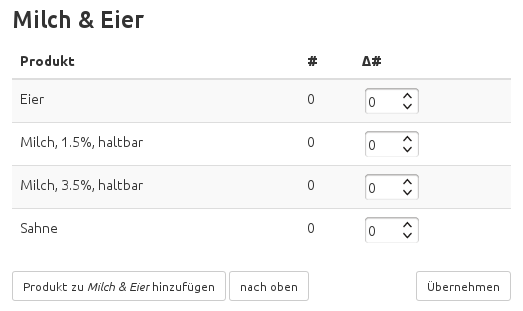
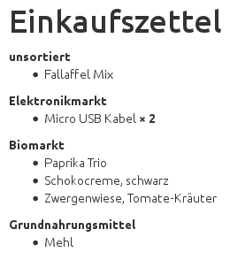
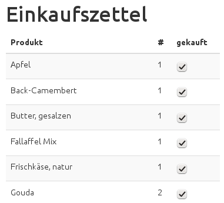

.. Copyright © 2015, 2017 Martin Ueding <dev@martin-ueding.de>

#############
shopping-list
#############

Having a plain paper shopping list somewhere in the house works, but having a
little web application where you can build the shopping list is even nicer:

- It shows you what products you have bought previously, so you can use it as a
  check list as well.

- Things that you did not buy for some reason get carried on to the next
  shopping list automatically.

- Several people can edit the list on the device of their choosing since it is
  build with the Bootstrap__ framework and scales from desktop to phones.

__ http://getbootstrap.com/

- The products are grouped by the shelves in your default supermarket, such
  that their order is according to the order in the supermarket.

This is what the main screen looks like:

    Part of the screen where one enteres the desired products.

Then you can display the shopping list any time on the browser on your phone.

    Part of the generated shopping list.

After you are done shopping, mark the items you bought as done. Or rather,
uncheck all the elements that you did not get:

    Part of the aftermath screen.

I have it running on my Raspberry Pi at home, you could also install it on your
own web server. Since it requires Python Django, it cannot be installed on a
managed/shared hosting, sorry about that.

Installation
============

Installation on Debian 7
------------------------

Installation of package
~~~~~~~~~~~~~~~~~~~~~~~

There is a Debian 7 package here:

One-off installation
    First, install the dependencies::

        aptitude install python-django apache2 libapache2-mod-wsgi python-mysqldb mysql-server mysql-client

    You can just download the `latest package
    <http://debian.martin-ueding.de/binary/>`_ and install it using::

        dpkg -i shopping-list_1.0.6-django1.4-2_all.deb

    It will then probably complain about missing dependencies, then you have to
    install those with ``apt-get`` or ``aptitude`` yourself. You will not get
    automatic updates of the package.

Add repository
    You can add this as a repository to your system by adding the following
    line to ``/etc/apt/sources.list``::

        deb http://debian.martin-ueding.de/ /

    Then you can install it with::

        aptitude update
        aptitude install shopping-list

    You will have to confirm that you want to install this untrusted package.
    If ``mysql-server`` was installed before, you will be asked to set a root
    password for MySQL. Write that down!

Database installation
~~~~~~~~~~~~~~~~~~~~~

On any system, you will need a database set up for this project. I have used
MySQL so far and will describe how this works in detail.

To set up a new MySQL user and database, do the following. Start the MySQL
client:

.. code-block:: console

    $ mysql -u root -p
    Enter password:

Then create a new database called ``django`` (or something else):

.. code-block:: sql

    CREATE DATABASE django;

Then create a new user called ``django`` (or something else) and grant that new
user all priviliges on the ``django`` database:

.. code-block:: sql

    CREATE USER 'django'@'localhost' IDENTIFIED BY 'password';
    GRANT ALL PRIVILEGES ON django . * TO 'django'@'localhost';
    FLUSH PRIVILEGES;
    exit

In ``/etc/shopping-list/`` there is the file ``databases.js.sample`` which
contains the databases snippet for the Django configuration. Create a copy a
copy of the file at ``databases.js`` in the same folder. The program will look
for it there. The copy has to be done that APT will not overwrite your changed
configuration when a new version comes out.

The file looks likes this:

.. code-block:: javascript

    {
        "default": {
            "ENGINE": "django.db.backends.mysql",
            "NAME": "django",
            "USER": "django",
            "PASSWORD": "PASSWORD",
            "HOST": "localhost"
        }
    }

Insert the database name (``NAME``), the user (``USER``) and the password
(``PASSWORD``) you have just configured. The host can be left to be localhost.

Fill database, admin interface
~~~~~~~~~~~~~~~~~~~~~~~~~~~~~~

Now you have to let Django fill up the database. Run ``manage-shopping-list
syncdb`` to fill the database. It will also let you set up a password for the
admin interface. It looks like this:

.. code-block:: console

    # manage-shopping-list syncdb
    Creating tables ...
    Creating table django_admin_log
    Creating table auth_permission
    Creating table auth_group_permissions
    Creating table auth_group
    Creating table auth_user_user_permissions
    Creating table auth_user_groups
    Creating table auth_user
    Creating table django_content_type
    Creating table django_session
    Creating table shoppinglist_shelf
    Creating table shoppinglist_product

    You just installed Django's auth system, which means you don't have any superusers defined.
    Would you like to create one now? (yes/no): yes
    Username (leave blank to use 'root'):
    E-mail address:
    Error: That e-mail address is invalid.
    E-mail address:
    Password:
    Password (again):
    Superuser created successfully.
    Installing custom SQL ...
    Installing indexes ...
    Installed 0 object(s) from 0 fixture(s)

Then restart Apache httpd with::

    service apache2 restart

You should be able to access the thing now at::

    http://HOSTNAME/shoppinglist/

There is an admin interface at::

    http://HOSTNAME/shoppinglist/admin/
